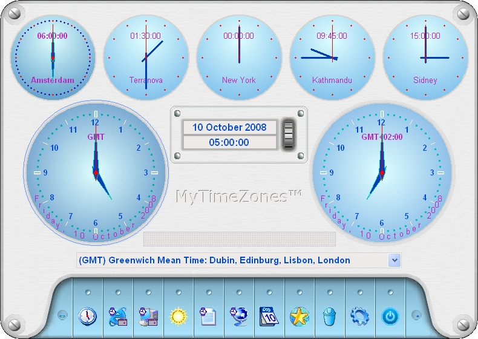



## MyTimezones

### Description

Some little changes are made.

Some bugs fixed and also the problem with the FlatButton control.

Moved the manifest file to the Resource file MyTimeZones.res, so the file is not needed anymore in the map of MyTimeZone.exe.

Add a manifest file for changing the layout in the GetOpenFile window when MyTimeones runs as exe.

Add the changed controls in the project.

Some changes are made.

MyTimezones 5.00 is an easy to use program for showing the times in the specified timezones. See the screenshot and read the ReadMe.txt file for more details.
 
### More Info
 

             |
---                |---
**Submitted On**   |2008-10-10 05:00:00
**By**             |[Ben Vonk](https://github.com/Planet-Source-Code/PSCIndex/blob/master/ByAuthor/ben-vonk.md)
**Level**          |Intermediate
**User Rating**    |4.5 (45 globes from 10 users)
**Compatibility**  |VB 6\.0
**Category**       |[Complete Applications](https://github.com/Planet-Source-Code/PSCIndex/blob/master/ByCategory/complete-applications__1-27.md)
**World**          |[Visual Basic](https://github.com/Planet-Source-Code/PSCIndex/blob/master/ByWorld/visual-basic.md)
**Archive File**   |[MyTimezone2220732262012\.zip](https://github.com/Planet-Source-Code/ben-vonk-mytimezones__1-71022/archive/master.zip)

